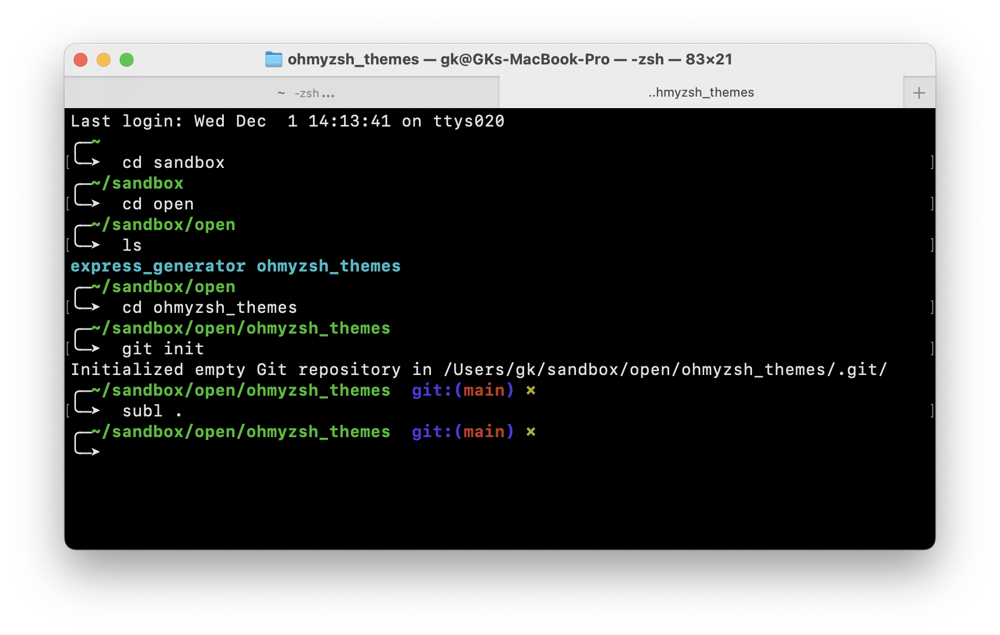
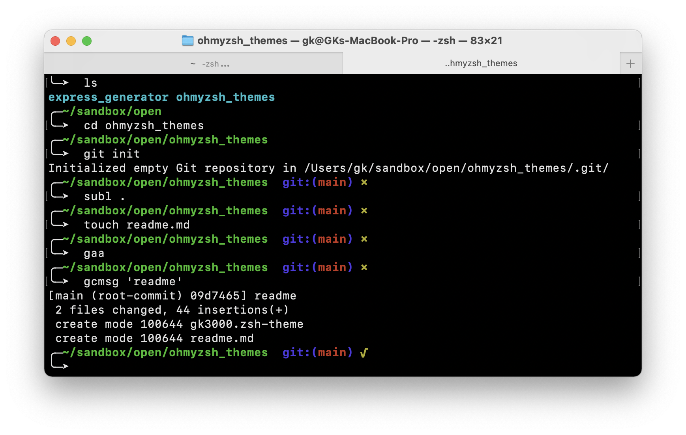

# GK3000 Oh My Zsh theme

Displays full path to current location (without hostname) and a prompt on next line 

Displays current git branch if it exists

Displays x for uncommitted git history and v for clean 

---

---

---

## Installation

Copy `gk3000.zsh-thme` file to `~/.oh-my-zsh/themes` folder and activate in `~/.zshrc`:

	ZSH_THEME="gk3000"

Then `source ~/.zshrc`.

Done!